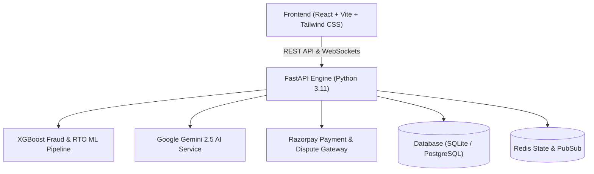

# Kryptic — Real-Time Payment Flow Digital Twin & Adaptive Risk Intelligence

[](LICENSE)
[](frontend/)
[](backend/)
[](models/)
[](https://kryptic-sooty.vercel.app)

**Kryptic** is an enterprise-grade, AI-native payment risk intelligence and dispute automation platform. Built for merchants, fintechs, and payment gateways, Kryptic unifies **real-time ML fraud detection**, **e-commerce Return-to-Origin (RTO) prediction**, **automated Gemini-powered chargeback representment**, and a **Digital Twin simulation canvas** to detect, localize, and mitigate payment threats with zero human bottleneck.

---

## 🚀 Key Modules & Capabilities

### 1. 🛡️ Disputes & Chargebacks Auto-Responder (`/chargebacks`)
* **Live Razorpay Sync**: Pulls real disputes, transaction metadata, and 3D Secure (3DS) authentication telemetry.
* **Gemini AI Evidence Generation**: Automatically parses delivery tracking, GPS timestamps, AVS/CVV checks, and liability shift rules to construct high-win-rate representation packets.
* **One-Click Representation Letter**: Generates and downloads formal merchant representation letters (`.txt` & `.pdf`) ready for issuing bank arbitration.
* **Direct Dispute Submission**: Submits defense packages directly into the payment gateway arbitration queue with instant state tracking.

### 2. 📦 Order & Return (RTO) Risk Scorer (`/returns`)
* **Real-Time Order Risk Scoring**: Evaluates incoming checkout sessions (COD vs Pre-paid, historical return rate, pin code risk, customer account age, basket ticket size).
* **Expected RTO Loss Prevention**: Calculates net rupee losses averted by restricting risky COD orders to instant UPI/card payment.
* **Interactive Decision Log**: Clickable order log table feeding live risk dossiers into the evaluation workspace.

### 3. 🧠 Real-Time Fraud Detection & SHAP Explainability (`/intelligence/detection`)
* **Production XGBoost Predictor**: Sub-millisecond inference trained on financial transaction benchmarks (99.988% accuracy, 98.7% recall, 0.0067% FPR).
* **Explainable AI (SHAP Impact)**: Quantifies exact positive and negative feature contributions driving risk scores.
* **Synthetic Attack Simulation Lab**: Stress-tests payment rails against velocity bursts, credential stuffing, coordinated syndicate rings, and behavioral anomalies.

### 4. ⚡ Payment Intelligence Dashboard (`/payments`)
* **Full-Page Analytics**: Scaled high-density metrics for volumes, approval rates, chargeback ratios, and revenue-at-risk.
* **Reactive Multi-Filtering**: Instantly slices datasets across volume bands, channels (UPI, Cards, NetBanking, Wallets), auth protocols (3DS, OTP), risk bands, and clusters.
* **CSV Export**: Direct one-click download of filtered transaction records and audit data.

### 5. 🚨 Alerts & SOC Emergency Defense Console (`/admin/alerts` & `/alerts`)
* **Real-Time SOC Event Stream**: Live telemetry monitoring velocity spikes, OTP failure bursts, and cross-border anomalies.
* **One-Click Mitigation Actions**: Trigger step-up 2FA, IP subnet blocks, gateway TPS throttling, or temporary account freezes with graph propagation.
* **Export Audit Trail**: Generates timestamped compliance logs.

### 6. 📊 Model Evaluation & Compliance Reports (`/system/evaluation` & `/admin/reports`)
* **Production Model Cards**: Live visibility into model weights, dataset provenance, holdout validation benchmarks, and operational false-positive costs.
* **ROC & Precision-Recall Curves**: Visual interactive performance curve benchmarks.
* **Automated Risk Audits**: Downloadable compliance and risk intelligence audit dossiers.

### 7. 🔌 Razorpay Settings & Webhook Integrations (`/connectors`)
* **Secure API Credential Management**: Runtime configuration for Razorpay Key IDs and Gemini AI endpoints.
* **Live Connection Ping**: Immediate verification of API health and authentication status.
* **Webhook Receiver**: Real-time event listener for `payment.captured`, `dispute.created`, and `payment.failed`.

---

## 🏗️ Architecture & Technology Stack



| Layer | Technologies Used |
| :--- | :--- |
| **Frontend UI** | React 18, TypeScript, Tailwind CSS, Vite, Lucide React, Recharts, React Router v6 |
| **Backend API** | Python 3.11+, FastAPI, Pydantic v2, SQLAlchemy, Uvicorn, WebSockets |
| **Machine Learning** | XGBoost, Scikit-learn, Isolation Forest, K-Means Clustering, SHAP |
| **AI / LLM** | Google Gemini 2.5 Flash API (Dispute & Evidence Reasoning) |
| **Integration** | Razorpay Node/Python SDK, Webhook HMAC Verification |
| **Deployment** | Vercel (Frontend), Python ASGI Container (Backend) |

---

## ⚡ Quick Start & Local Setup

### Prerequisites
* **Node.js**: v18.0 or higher
* **Python**: v3.10 or higher
* **Git**

### 1. Clone the Repository
```bash
git clone https://github.com/KaayshaRao20/Kryptic.git
cd Kryptic
```

### 2. Backend Setup
```bash
cd backend

# Create virtual environment
python -m venv venv
# On Windows:
.\venv\Scripts\activate
# On Linux/macOS:
source venv/bin/activate

# Install dependencies
pip install -r requirements.txt

# Run FastAPI backend server
uvicorn app.main:app --reload --host 0.0.0.0 --port 8000
```
Backend will be live at `http://localhost:8000` (API Docs at `http://localhost:8000/docs`).

### 3. Frontend Setup
```bash
cd ../frontend

# Install dependencies
npm install

# Start Vite development server
npm run dev
```
Frontend will be live at `http://localhost:5173`.

---

## 📡 REST API Reference Overview

| Route | Method | Description |
| :--- | :---: | :--- |
| `/api/v1/chargebacks` | `GET` | Fetch all merchant disputes & active chargebacks |
| `/api/v1/chargebacks/generate-evidence` | `POST` | Generate Gemini AI representation letter & defense pack |
| `/api/v1/chargebacks/{id}/submit` | `POST` | Submit finalized defense package to bank arbitration |
| `/api/v1/returns/score` | `POST` | Score an e-commerce order for Return-to-Origin (RTO) risk |
| `/api/v1/returns/metrics` | `GET` | Retrieve aggregate RTO metrics and loss prevention sums |
| `/api/v1/risk/predict` | `POST` | Real-time transaction fraud probability & SHAP inference |
| `/api/v1/risk/model-card` | `GET` | Retrieve active XGBoost model holdout metrics & confusion matrix |
| `/api/v1/risk/events` | `GET` | Stream active risk and anomaly events |
| `/api/v1/transactions` | `GET` | Query paginated merchant payment stream with filters |
| `/api/v1/razorpay/payments` | `GET` | Fetch real-time payment transactions from Razorpay |
| `/api/v1/twin/state` | `GET` | Get live Digital Twin payment flow topology health |
| `/api/v1/twin/propagate-risk` | `POST` | Execute cascading risk mitigation across payment nodes |
| `/api/v1/settings/keys` | `POST` | Update and validate Razorpay and Gemini API credentials |

---

## 🛡️ Security & Privacy
* **PCI-DSS Compliance Alignment**: Card numbers and sensitive authentication values are tokenized; only masked last 4 digits are displayed.
* **HMAC Webhook Signatures**: All incoming payment gateway webhooks verify SHA-256 HMAC digital signatures.
* **3D Secure Liability Shift**: Automated validation of `liability_shifted: true` tags for dispute arbitration.

---

## 👥 Contributors & Authors
* **Kaaysha Rao** — Lead Developer & Project Maintainer ([@KaayshaRao20](https://github.com/KaayshaRao20))

---

## 📄 License
This project is open-source under the [MIT License](LICENSE).

